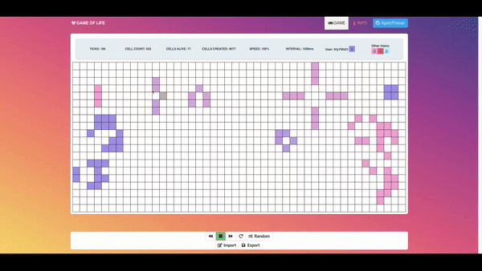

# Multiplayer Game Of Life

Multiplayer Conway's Game of Life implemented with Vue.js, Express and socket.io



Play the game at https://gameoflife.agrimprasad.com

The frontend is deployed using Netlify and communicates with the API Server on Heroku deployed at https://stark-lake-47409.herokuapp.com

Check out the API docs at https://stark-lake-47409.herokuapp.com/api-docs

## Project Goals

Conway's Game of Life is an interesting simulation of 'Life' as a grid of cells. The game is automated and based on 4 rules that determine the status of all cells inside the grid. A cell can either be 'alive' or 'dead'. Every turn (tick) rules get applied to all cells that are currently alive.

This project aims to take this further by allowing multiple players to play the game at the same time, with the ability to click cells, interact with the cell grid and start/stop the simulation in parallel in real time.

Furthermore, the game provides a toolbar where players can import interesting patterns or copy interesting patterns from the grid to their clipboard.

### Conway's Game of Life Logic

1. Any live cell with fewer than two live neighbours dies, as if caused by under-population.

1. Any live cell with two or three live neighbours lives on to the next generation.

1. Any live cell with more than three live neighbours dies, as if by overcrowding.

1. Any dead cell with exactly three live neighbours becomes a live cell, as if by reproduction.

## Architecture

This implementation has the following high-level architecture:

### Client

Vue.js based app with socket.io client-side library.

Vue.js was chosen for the following reasons:

1. Mature client-side library with a lively ecosystem.

1. Simpler framework as compared to alternatives such as React. The core of the framework simply consists of HTML templating, component level scoped CSS and JavaScript for logic handling.

1. Standard tooling: Rather than a myriad of different library options present for alternatives such as React, most implementations use `vue-router` for client-side routing and `vuex` for state management. Note that this project has been kept simple and doesn't use these routing/state-management libraries.

socket.io was chosen due to the following features:

1. In-built connection/disconnection logic.

1. Connection resilience with transparent fallback from WebSocket to other polling techniques using Ajax.

### Server

Node.js (Express) based server with socket.io server-side library for handling communications between different players.

This choice was made due to socket.io being well integrated with the Node.js ecosystem.

## Development Guide

### Git workflow

1. This repo follows the [Git Flow](https://www.atlassian.com/git/tutorials/comparing-workflows/gitflow-workflow) workflow with `master` branch used for production and `next` branch used as a `stage` branch for integration testing.

1. Feature branches are branched from `next` usually, and new pull requests should be created towards `next`.

1. A merge to `next` branch results in deployment to a `stage` environment where testing is performed before deployment to production.

1. After integration testing has been performed on the `stage` environment, a pull request should be opened from the `next` branch towards the `master` branch. Once this pull request is merged, the latest `master` changes are deployed to production.

### Local Development

1. This project uses Vue.js for the client and Express + Node.js for the server. So firstly, you need to install all these dependencies. We will assume that you are setting up this project on MacOS with Homebrew available. Please check the relevant packages' documentation for other OSes.

   1. Install `node` and `npm` with `brew install node`

   1. Clone this repo from GitHub with `git clone https://github.com/AgrimPrasad/Multiplayer-GameOfLife.git`.

   1. Run `npm install` to install all development and runtime dependencies to the local `node_modules` directory.

   1. To run the server locally, run `npm run server`. This will trigger `nodemon` to start the server locally at `http://localhost:3000` and watch the server files for any changes.

   1. To run the client locally, run `npm run serve-client`. This will start a development Vue.js server and the app will be available at `http://localhost:8080/`. The client is configured to communicate with the server at `http://localhost:3000` by default.

   1. To build the client locally, run `npm run build-client`, which will output the built static JS/CSS/HTML files to the `./dist` directory.

### Project Organization

```bash
├── __tests__
|  ├── client.js
|  └── server.js
├── babel.config.js
├── jest.setup.js
├── public
|  ├── favicon.ico
|  └── index.html
├── server
|  ├── app.js
|  ├── index.js
|  ├── routes
|  ├── run.js
|  ├── shared.js
|  ├── static
|  └── util.js
├── src
|  ├── App.vue
|  ├── assets
|  ├── components
|  ├── helpers.js
|  ├── main.js
|  └── scss
└── vue.config.js
```

1. Server code lives in the `./server` directory.

1. Client code lives in the `./src` and `./public` directories. `vue.config.js` and `babel.config.js` contain some custom configuration for Vue.js.

1. All test files are in the `__test__` directory. Note that currently, only a few tests have been added as smoke tests for both the client and server. `jest.setup.js` contains some custom configuration for Jest.

### Tests

Tests are run using the [Jest](https://jestjs.io/) testing and mocking library, which was chosen due to it being an integrated framework for testing, mocking and asserting which works with both Vue.js and Express.js

1. To run both client and server tests, run `npm run test` which will trigger `jest`.

1. If you want `jest` to watch your files while you are modifying them, run `npm run test-watch`.

1. To run `eslint` linting rules on client files, run `npm run lint-client`. For server files, run `npm run lint-server`. Note that files have been formatted locally using `prettier`, although there is no `prettier` based linter in the CI/CD pipeline currently.

### CI/CD

The server is deployed on Heroku, while the client is deployed to Netlify. This ensures segregation of client and server code, while allowing us to deploy the client as a static app served with a built-in Netlify CDN.

#### Continuous Integration

CI Tests (including linting tests) are run using GitHub Actions. The GitHub Actions steps for this are configured in `.github/workflows/build.yml`.

The test step runs `npm test` using the `jest` library as mentioned in the `Tests` section above. Server and client Linting is also performed here using `eslint`.

#### Backend Continuous Delivery

Backend is deployed using GitHub Actions to Heroku. Pushing a commit to GitHub should trigger GitHub Actions to run automatically.

1. To install the `heroku` command-line client locally, run `brew install heroku/brew/heroku`. Then login to heroku with `heroku login`

1. `Dockerfile` configured in the root of this repo is used to build a docker image for the server. Docker Build steps are defined for `stage` in `.github/workflows/next.yml` which is only triggered on a new push to the `next` branch.

1. [Heroku Actions](https://github.com/actions/heroku) plugin for Github Actions is then used to push the built server Docker image to the `stage` app's Heroku Container Registry, set environment variables and then release a tested docker image to the `stage` app which is running on Heroku at https://stark-plains-46658.herokuapp.com . These steps are also in `.github/workflows/next.yml`.

1. `.github/workflows/master.yml` defines the steps to build, push and release a tested Docker image to the `production` app which is running on Heroku at https://stark-lake-47409.herokuapp.com These steps are only triggered on a new push to the `master` branch.

1. `NODE_ENV` environment variable is set to `production` in `.github/workflows/next.yml` and `.github/workflows/master.yml` using the Heroku `config:set` command to trigger server builds with production settings, such as no debug server logs.

1. `HEROKU_API_KEY` secret is defined on the Github repo and is only accessible to repo collaborators for use. It was generated using `heroku authorizations:create` locally.

1. Heroku apps for `stage` and `production` were generated using the following commands locally: `heroku create --remote staging` and `heroku create --remote production`.

#### Frontend Continuous Delivery

Frontend deployment to Netlify is configured using a `netlify.toml` file present at the root of this repo.

1. The client app is built using `npm install && npm run build-client` which triggers the `vue-cli-service` to build a static production site.

1. The static files are then deployed to Netlify using appropriate values for the `VUE_APP_SERVER_ADDRESS` environment variable to configure the server address accessed by the frontend on different environments.

1. DNS is configured in the Netlify UI to point the `next` branch deployment to https://next.gameoflife.agrimprasad.com/ for `stage` testing and the `master` branch deployment to https://gameoflife.agrimprasad.com/ for the production deployment. Preview deployments are dynamically generated by Netlify on any push to feature branches.

## Implementation Details

### Client Logic

1. The game is implemented in ticks of 1-second interval by default, and the user can change this interval to a slower value if desired. On every tick, the state of the entire grid is re-evaluated based on new inputs received from different clients using socket.io

1. The browser connects to an Express API server which allows multiple clients to share the same world-view.

1. When a new client is initiated (e.g. by opening a new browser window), it gets the current state of the game by calling the `/api/grid/current` GET endpoint.

1. When a user clicks anywhere on the grid, a live cell is created at that location with the user's colour and a POST call to `/api/grid/click` is sent for server update and socket.io broadcast. A given cell is associated with a single colour throughout its lifetime and dead cells are coloured white.

1. When a user imports a pattern or generates a random pattern, bulk update of cell states is performed and the `/api/grid/clicks` POST endpoint is called to bulk-update the server state and broadcast these changes to other clients.

1. Clicking on the Play, Pause, Change interval and Reset buttons also triggers POST API calls to appropriate endpoints for global state propagation. These API endpoints are `/api/grid/start`, `/api/grid/pause`, `/api/grid/interval` and `/api/grid/reset`. The server again propagates these changes to all clients using socket.io

1. User connection/disconnection logic is largely handed off to socket.io . It was found that reconnection doesn't handle cell update sync-ing properly as the `Grid` Vue component doesn't react immediately after a reconnection. Thus, the `Grid` Vue component is re-created upon reconnection, with its variables being re-rendered. This can refresh the app state successfully in tests.

### Server Logic

1. The server API docs are available at https://stark-lake-47409.herokuapp.com/api-docs

1. The server-side logic is implemented using Express as a set of REST-ful API endpoints and socket.io pub-sub messages, which together provide functionality such as user management and grid state management.

1. Each client is assigned a unique nickname and colour on initial connection through socket.io

1. The list of users is broadcast to all clients, which then display this information on the frontend in real-time.

1. Events from the frontend (such as user clicks on the grid, the start of a simulation etc.) are all synchronised using socket.io pub-sub messages.

   1. In general, the flow of messages is `client creates event` -> emits the event to server -> server updates shared state if applicable (e.g. a list of users or active cells) -> server broadcasts the update to all users.

1. Client connection/disconnection events are handled using socket.io's built-in functionality to detect such events.

1. When a dead cell is revived, it is given a colour which is the mathematical average of its neighbours.

1. CORS is enabled on the server to allow the client to connect to API endpoints from a different host. A production-grade application should whitelist the specific hosts where CORS is allowed.

## Limitations

1. Multi-cell updates (e.g. clicking on the `Random` button or loading patterns) don't take effect immediately on the frontend if a simulation is running and a new update comes in. Logic could be added to block new simulation updates after such updates.

1. The footer is not visible in the viewport on iPhone Safari and the user has to scroll down to view the footer. This issue is not present when tested on common Android phones and should be fixable using CSS media queries.

1. The drag functionality on the cell grid is limited to mouse events currently and doesn't work on mobile. A mobile touch-friendly library such as [vue-touch](https://alligator.io/vuejs/vue-touch-events/) could be used to respond to such mobile drag events.

1. It is found in rare cases that the Express server may stop working suddenly with 30 second timeout limit of Heroku being exceeded with 503 error returned to the frontend. This is more common when the number of clients exceed 3 to 4 clients connected over long periods of time. Possibly, there is some memory leak or edge case which is triggered in this case.

   1. This seems to be a common issue with Node.js documented by Heroku itself at https://help.heroku.com/AXOSFIXN/why-am-i-getting-h12-request-timeout-errors-in-nodejs

   1. If you start seeing 503 timeout errors with the `production` app at http://gameoflife.agrimprasad.com (when trying to connect to https://stark-lake-47409.herokuapp.com), try using the `stage` app at https://next.gameoflife.agrimprasad.com (which will attempt to connnect to https://stark-plains-46658.herokuapp.com)

   1. The only way currently to fix this issue is to restart the server running on Heroku with the `heroku restart` command. For example, to restart the `stage` server app, run `heroku restart -a stark-plains-46658` (need appropriate access obviously). Proper debugging can be performed in the future to figure out the bug which can cause this condition to occur in the server app.

## Extension Ideas

1. Server scaling: The list of users and there associated metadata (such as username and colours) could be stored in a shared cache such as [Redis](https://redis.io/) or in a managed key-value database such as [DynamoDB](https://aws.amazon.com/dynamodb/). The same could be done for the global grid state.

   1. This way, each server instance becomes stateless by itself, with the actual state being stored/retrieved by each instance from the shared database.
   1. Furthermore, redis distributed locks could be used to prevent race conditions in updates with multiple instances.

1. Currently, the client and server code share the same `node_modules` dependencies, due to which the JS bundle on the client is quite big (almost 0.5 MB). Could use a library such as [Lerna](https://lerna.js.org/) to change this repo into a mono-repo (aka multi-package repository), with separate client and server directories using some common dependencies where applicable.

1. User authentication could be implemented as an additional set of `user` endpoints, with social login implemented using an authentication service such as [Auth0](https://auth0.com/). Unauthenticated users would not be able to access any grid-specific endpoints.

1. The server API could be versioned as `/v1`, `/v2` etc. to allow for breaking changes.

1. The Heroku server could be proxied by a DDoS prevention service such as Cloudflare to prevent common online attacks.

1. More unit tests and integration tests should be added. Only smoke tests were added here due to time constraints. Tests should cover component behaviour, mock API responses and especially account for error cases, such as reconnection or API timeouts.

## Credits

This project was inspired in various ways by the following existing projects:

1. [Ijee/Game-of-Life-Vue2](https://github.com/Ijee/Game-of-Life-Vue2) Vue based implementation of the Game of Life. Much of the CSS styling and Vue component organization comes from here.

1. [germanger/iosocket-game-of-life](https://github.com/germanger/iosocket-game-of-life) socket.io and Angular.js based implementation of Game of Life. The Multi-player logic takes inspiration from this project.

## Reach Out

Follow me on [Twitter](https://twitter.com/AgrimPrasad) for more such interesting projects! Also give my blog a visit at [https://agrimprasad.com](https://agrimprasad.com/) where I post interesting technical articles every once in a while.
